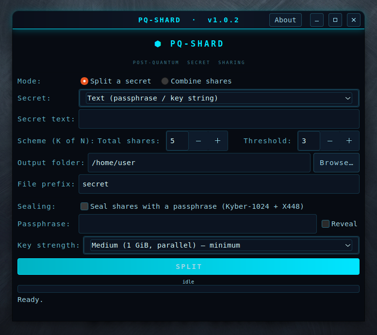

<div align="center">

<a href="https://github.com/effjy/pq-shard/"></a>

**Split a secret into _N_ shares so that any _K_ of them rebuild it — and fewer
reveal nothing. A GTK3 desktop app and CLI for Shamir's Secret Sharing, with an
optional post-quantum sealing layer.**

Author: **Jean-Francois Lachance-Caumartin**

[](LICENSE)
[](#)
[](#)
[](#)
[](#)
[](#)

[](#)
[-00b3c4.svg?style=flat-square)](#)
[](#)
[](#)
[](#)

</div>

---

## Screenshot

<div align="center">



*The PQ-Shard window — choose a K-of-N scheme, split a passphrase, key or file
into shares, and optionally seal each share under a post-quantum passphrase.*

</div>

---

## Why PQ-Shard?

Every password manager, encrypted disk and key vault eventually has the same
single point of failure: **one master secret** that, if lost, takes everything
with it — and if copied, leaks everything at once. PQ-Shard removes that single
point of failure.

It splits a secret into **N shares** such that **any K** of them reconstruct it
and **any K−1 reveal absolutely nothing** (this is information-theoretic, not
just computational, security). Hand the shares to different people, devices or
locations:

- **Key backup & recovery** — split a disk-encryption key or KEM private key
  3-of-5 across safes, a relative and a bank box. Lose two and you still
  recover; an attacker needs three.
- **Shared custody** — require 2-of-3 trustees to agree before a secret can be
  reassembled.
- **Estate / break-glass** — distribute shares so a secret survives you without
  any one holder being able to use it alone.

## Features

- **Shamir's Secret Sharing** over **GF(2⁸)** — any *K* of *N* shares
  reconstruct the secret; fewer reveal nothing (information-theoretic secrecy).
- Split **text** (a passphrase or key string) or **any file** (binary-safe),
  up to 64 MiB.
- **Built-in reconstruction check** — a verification tag is secret-shared
  *together with* the secret, so a successful recovery is confirmed and wrong,
  foreign or corrupted shares are detected — without the tag ever leaking
  anything below the threshold.
- **Per-share integrity** — each plain share carries a BLAKE2b checksum, so a
  flipped byte is caught and the bad share named.
- Optional **post-quantum sealing** — each share is additionally encrypted
  under a passphrase via a **Kyber-1024** (NIST level 5) **+ X448** hybrid KEM
  with **Argon2id**. A sealed set then needs *K* shares **and** the passphrase.
- **Hardened memory** — secrets, shares and passphrases live in locked,
  non-dumpable memory that never hits swap and is zeroed after use; core dumps
  are disabled.
- Both a **GTK3 desktop app** (`pqshard-gui`) and a scriptable **CLI**
  (`pqshard`) over one shared, GTK-free crypto core.

## Prerequisites

A C compiler, `make`, and the development packages for GTK3, libsodium,
libargon2 and OpenSSL (libcrypto, used for the X448 curve).

### Ubuntu / Debian

```bash
sudo apt update
sudo apt install build-essential pkg-config \
    libgtk-3-dev libsodium-dev libargon2-dev libssl-dev
```

### Fedora

```bash
sudo dnf install gcc make pkgconf-pkg-config \
    gtk3-devel libsodium-devel libargon2-devel openssl-devel
```

## Building

```bash
make
```

This produces two binaries in the project directory: `pqshard-gui` (the GTK3
app) and `pqshard` (the CLI). Run them directly with `./pqshard-gui` or
`./pqshard`.

## Installing

To install globally so the app appears in your applications menu (with its
icon) and shows its icon in the window/taskbar:

```bash
sudo make install
```

This installs:

| File | Destination |
|------|-------------|
| `pqshard-gui` binary | `/usr/local/bin/pqshard-gui` |
| `pqshard` CLI        | `/usr/local/bin/pqshard` |
| Application icon     | `/usr/local/share/icons/hicolor/scalable/apps/pqshard.svg` (+ raster sizes) |
| Menu entry           | `/usr/local/share/applications/pqshard.desktop` |

The desktop database and icon cache are refreshed automatically. The app then
appears in your activities/applications menu as **PQ-Shard**.

To uninstall:

```bash
sudo make uninstall
```

> Installation prefix is configurable, e.g. `sudo make install PREFIX=/usr`.

## Usage — desktop app

1. Launch **PQ-Shard** from the applications menu, or run `pqshard-gui`.
2. Choose **Split a secret** or **Combine shares**.
3. **To split:** pick the secret (text or a file), set the **scheme** (Total
   shares *N* and Threshold *K*), choose an output folder and file prefix, and
   click **SPLIT**. Optionally tick **Seal shares with a passphrase** to add the
   post-quantum layer.
4. **To combine:** add at least *K* share files, choose whether to show the
   recovered secret on screen or save it to a file, supply the passphrase if the
   shares are sealed, and click **COMBINE**.

## Usage — CLI

```text
pqshard split   [options]            Split a secret into N shares.
pqshard combine [options] <share>... Reconstruct a secret from shares.
pqshard inspect <share>...           Show share metadata (no secret).
```

**Split** a passphrase 3-of-5 (secret read from stdin):

```bash
printf 'correct horse battery staple' | pqshard split -n 5 -k 3 -o ./shares
```

**Split** a key file 2-of-3 and **seal** each share under a passphrase:

```bash
pqshard split -f disk.key -n 3 -k 2 --seal -o ./shares
```

**Combine** any *K* shares back into the secret:

```bash
pqshard combine ./shares/secret.1of5.shard \
                ./shares/secret.3of5.shard \
                ./shares/secret.5of5.shard -o recovered.key
```

**Inspect** a share without reconstructing anything:

```bash
pqshard inspect ./shares/secret.1of5.shard
```

| split option | meaning |
|--------------|---------|
| `-n N`       | total number of shares (default 5) |
| `-k K`       | threshold needed to reconstruct (default 3) |
| `-f FILE`    | read the secret from `FILE` (binary). Default: read stdin |
| `-t TEXT`    | use `TEXT` as the secret |
| `-o DIR`     | output directory for share files (default `.`) |
| `-p PREFIX`  | share file name prefix (default `secret`) |
| `-s`, `--seal` | seal each share under a prompted passphrase (hybrid KEM) |
| `--kdf LVL`  | with `--seal`: `basic` \| `medium` \| `strong` (default `medium`) |

## How it works

Each byte of the secret becomes the constant term of an independent random
degree-`(K−1)` polynomial over **GF(2⁸)**. A share is that family of
polynomials evaluated at a distinct non-zero x-coordinate. Reconstruction is
Lagrange interpolation back to `x = 0`. With fewer than `K` shares every secret
value is equally likely, so the shares leak nothing — this is **Shamir's Secret
Sharing**, and its secrecy is information-theoretic.

The material that is actually split is `secret || BLAKE2b(set_id || secret)[:16]`
— the **verification tag is itself secret-shared**, so it discloses nothing
below the threshold yet lets a reconstruction confirm it recovered the intended
secret (and reject inconsistent or foreign shares).

### Share file format (`.shard`)

A fixed 40-byte header (magic, version, flags, `K`, `N`, this share's
x-coordinate, a random `set_id`, and the secret length) is followed by the
share material.

- **Plain shares** append the share's y-material and a BLAKE2b-256 checksum over
  the whole file (so accidental corruption is caught and the share named).
- **Sealed shares** instead carry an Argon2id salt and parameters, a
  Kyber-1024 + X448 hybrid block (the share's hybrid secret key wrapped with the
  passphrase-derived key, plus the KEM ciphertext), and the y-material encrypted
  with XChaCha20-Poly1305 under the KEM shared secret. The 40-byte header is
  bound as associated data, so the AEAD tag also authenticates `K`/`N`/`x`/
  `set_id`. The hybrid design mirrors [Ciphers](https://github.com/effjy/ciphers).

## Security notes

- **Choose your threshold deliberately.** Any `K` shares reconstruct the secret;
  any `K−1` reveal nothing. A higher `K` is safer against compromise but less
  resilient to loss. `N − K` is how many shares you can afford to lose.
- **Plain shares are information-theoretically secure below the threshold** — no
  amount of computation extracts the secret from `K−1` shares. The optional
  passphrase sealing is *defence in depth*, not a replacement for the threshold:
  it adds a factor (a stolen sealed share still needs the passphrase, and a
  reconstruction needs both `K` shares and the passphrase).
- **Distribute shares independently.** The whole point is defeated if several
  shares sit in one place. Keep at least `K` of them apart.
- Secrets are kept off disk: core dumps are disabled, and secrets, shares and
  passphrases are held in locked, non-dumpable memory and zeroed after use. As
  with any GTK app, short-lived copies of typed text may still exist in ordinary
  memory (rendering, clipboard, input method), so this hardening reduces but
  cannot fully eliminate exposure.

## Changelog

### v1.0.2

- GTK3 desktop app and CLI over a shared, GTK-free secret-sharing core.
- Shamir's Secret Sharing over GF(2⁸) with an embedded, secret-shared
  verification tag and per-share integrity checks.
- Optional post-quantum sealing with the Kyber-1024 + X448 hybrid KEM and
  Argon2id.
- Hardened, non-dumpable, swap-free memory handling for all secret material.

## License

MIT.
